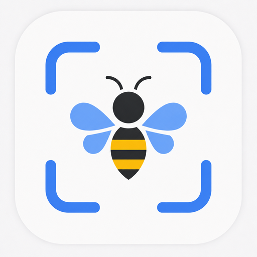

<p align="center">
  
</p>

<h1 align="center">FaunaPulse</h1>

<p align="center">
  An Android field application for detecting, tracking and documenting pollinators using on-device artificial intelligence.
</p>

<p align="center">
  <strong>On-device AI · Real-time tracking · Configurable models · Offline field use</strong>
</p>

## Overview

**The first and primary scientific use case of FaunaPulse is estimating *visitation rates* in pollination studies: how often pollinators visit a flower or inflorescence and how long each visit lasts.**

FaunaPulse is a passive, non-invasive imaging tool. Detection, tracking and image processing run **fully on-device** using [LiteRT](https://github.com/google-ai-edge/litert), so an internet connection is not required in the field. End-users place a draggable square **region of interest (ROI)** over a flower (or feeding site, nest entrance, animal path, observation area of interest, etc.). FaunaPulse then records activity within that region and also saves cropped JPEG images together with detailed session metadata. At the end of the recording session, it outputs a dashboard screen with info and graphs about the visitation rates and the captured images with the tracked objects for preview an check.

For interested end-users, saved ROI images can also be reviewed and cropped within FaunaPulse. Organism crops can then be shared directly on device with or imported into identification apps such as [Seek by iNaturalist](https://www.inaturalist.org/pages/seek_app), [ObsIdentify](https://observation.org/apps/obsidentify/), [BeeMachine](https://www.beemachine.ai/) or another preferred app or classification service. This allows FaunaPulse to remain focused on detection, tracking and documentation while end-users choose the identification service best suited to their needs. Note that at the time of releasing this repository, these apps enumerated above do not perform bulk (en mass) identification, but they work with one image per upload and internet connection is needed. FaunaPulse is designed mostly with offline usage in mind.

Saved images and session metadata can later be exported for analysis in R or Python research workflows. Image-classification tools such as [BioCLIP][bioclip] may be used separately to assist with taxonomic identification. A companion analysis workflow will also be developed.

Depending on the selected mode, FaunaPulse supports several modes of operation:

1. **Real-time AI-based object detection and tracking** using a compatible custom model;
2. **Motion-triggered** image capture;
3. **Time-lapse** image capture;
4. **Post-capture AI detection** processing of the motion or time-lapse images using either a single-model pass or [SAHI (Slicing Aided Hyper Inference)][sahi]. This can help reduce the amount of "empty" images (without pollinators / target object).

Modes 1-3 can also be **scheduled** - for example 1st run 9:00-12:00, 2nd run 13:00-17:00, daily; or with interruptions over night time if the smartphone(s) are deployed over multiple days.

FaunaPulse is not restricted to pollinators. With a suitable object-detection model, it can be configured for different wildlife groups and ecological observation settings. Its usefulness depends on the observation setup, selected capture mode and, for AI-based monitoring, the capabilities of the loaded model.

## Intended usage

- **Pollination research (primary usage):** measure and compare flower-visitation rates among plant species, (e.g., across habitats, land-management practices, environmental conditions / gradients, research treatments, etc.).
- **Citizen science:** observe flower visitors, garden wildlife and other local fauna using an ordinary Android smartphone.
- **Wildlife and activity monitoring:** record when, how often and for how long organisms appear within a selected observation area.
- **Biodiversity documentation:** capture fauna occurrences or events using AI detection, motion triggering or time-lapse capture.
- **Model-based wildlife surveys:** monitor wildlife categories supported by a compatible object-detection model.

## Project status

FaunaPulse is an **early research preview (alpha)**, provided as an experimental field tool rather than a validated monitoring product. Field validation is ongoing. Please treat it accordingly:

- Android is currently supported; iOS compatibility is planned for a later phase.
- AI-based monitoring requires a compatible `.tflite` object-detection model.
- Built-in (on device) en masse automated taxonomic identification is not yet available.
- Detection accuracy and tracking performance depend on the model, smartphone, target organism and field setup.
- Visit counts may include missed, duplicated, split or merged tracks; review outputs before drawing scientific conclusions.
- Performance varies substantially between phone models. Prolonged continuous inference can cause the device to heat up, thermally throttle and drain the battery faster.
- Each scientific application should be validated under its intended field conditions before data collection at scale.

## Getting started

A short path from install to first data. See the linked guides for detail.

1. **Install the app.** Download the latest APK from the [Releases](https://github.com/valentinitnelav/fauna-pulse/releases) page, or build from source — both are covered in the [Installation & Testing Guide](docs/INSTALL.md).
2. **Grant permissions** when prompted: camera, location (one GPS fix per session) and notifications (used by the long-running recording service).
3. **Add a detection model.** AI modes need a compatible `.tflite` model; import one via the in-app model picker (see [INSTALL.md](docs/INSTALL.md)). Motion-triggered and time-lapse capture work without a model.
4. **Set up the shot.** Position the phone over your flower or observation area and drag the square region of interest (ROI) over it — see the [Field Guide](docs/FIELD_GUIDE.md).
5. **Run a short test session** first to confirm framing, detections and capture behave as expected before a long deployment.
6. **Inspect the output.** Review the captured crops on-device, and read `session.jsonl` on a computer — the [Data Guide](docs/DATA_GUIDE.md) documents the format and how to compute visitation rates in R or Python.
7. **Read the [known limitations](#project-status)** before relying on the data for scientific conclusions.

## Build and run on Android

For collaborators, see the step-by-step [Installation & Testing Guide](docs/INSTALL.md).

It covers both installing a ready-made app without coding and building FaunaPulse from source.

## Documentation

| Document | Audience | Purpose |
|---|---|---|
| [INSTALL.md](docs/INSTALL.md) | Tester / developer | Install a ready-made APK or build from source; import models. |
| [FIELD_GUIDE.md](docs/FIELD_GUIDE.md) | Field researcher | Run a session, read the live screen and troubleshoot. |
| [SETTINGS_REFERENCE.md](docs/SETTINGS_REFERENCE.md) | Field researcher | Understand every user setting. |
| [DATA_GUIDE.md](docs/DATA_GUIDE.md) | Researcher / analyst | Read the `session.jsonl` data dictionary and compute visitation rates in R or Python. |
| [HOW_PHOTO_RESOLUTION_WORKS.md](docs/HOW_PHOTO_RESOLUTION_WORKS.md) | Developer | Understand why a small ROI can still yield sharp photographs. |
| [ARCHITECTURE.md](docs/ARCHITECTURE.md) | Developer | Understand the data flow and native-to-Dart contract. |
| [CONTRIBUTING.md](docs/CONTRIBUTING.md) | Developer | Build, test and follow repository conventions. |
| [PERF_AND_ROBUSTNESS_REVIEW.md](docs/PERF_AND_ROBUSTNESS_REVIEW.md) | Code agent | Review the prioritized performance and robustness roadmap. |
| [AGENT_CHANGELOG_OVERVIEW.md](docs/AGENT_CHANGELOG_OVERVIEW.md) | Code agent | Read the current-state development overview. |
| [AGENT_CHANGELOG.md](docs/AGENT_CHANGELOG.md) | Code agent | Read the detailed append-only development journal. |

## Why I built FaunaPulse

The idea for FaunaPulse grew from my research at the Helmholtz Centre for Environmental Research [(UFZ)][ufz] and the German Centre for Integrative Biodiversity Research [(iDiv)][idiv].

During my [PhD][phd-stef] and research, we collected large image datasets of flower-visiting arthropods using affordable smartphones and time-lapse photography. The approach worked, but it also produced far more images than could be used efficiently. A selective camera trigger was therefore an obvious next step.

Conventional motion detection is easily activated by wind, moving vegetation and changes in light. Insects are also difficult to distinguish using heat-based sensors because their body temperature may be close to that of their surroundings. On-device AI object detection offered a promising way to capture images only when relevant organisms were present.

It was also clear early-on that a Region of Interest (ROI) needed implementation as well (proposed in [Ștefan et al. 2025][stefan-2025-a]). The square ROI reflects both the ecological question and the computer-vision pipeline: it concentrates observation on a target flower (or area of interest), reduces distracting background information and matches the square input commonly used by object-detection models.

Although FaunaPulse began as a pollinator-monitoring tool, I gradually realised that the same detection, tracking and capture workflow could support other organisms and observation tasks. I am releasing it as free and open-source software in the hope that it will also be useful to citizen scientists and research groups with limited funding. Moreover, smartphones are basically powerful micro-computers, usually always available on almost any market world-wide (at relatively affordable prices), so every scientist or citizen-scientist can use it as a field tool for contributing to measuring local biodiversity.

[phd-stef]: https://repo.bibliothek.uni-halle.de/handle/1981185920/125596

## AI-assisted development and transparency

FaunaPulse also began as a personal experiment in what is called **“vibe coding”**. Developing a custom Android field tool initially seemed likely to require substantial funding and professional app developers. As AI-assisted software-development tools became more capable, I decided to explore whether they could help me build the application myself.

I am a scientist with experience in R, Python, statistics and computer vision, but I am not a professional mobile-app developer. Most software development was assisted by [Claude Code](https://claude.com/product/claude-code), a paid tool that was instrumental in making this project possible. I recognise that access to paid AI tools is not equally available.

I defined the scientific requirements and design decisions, tested the application repeatedly on smartphones, inspected its outputs, created and updated documentation and overall architected the resulting software. Occasionally, ChatGPT or Gemini are used as additional sources of "critique".

Scientific literature was located using [Google Scholar](https://scholar.google.com), [Elicit](https://elicit.com/) and [Consensus](https://consensus.app/).

For transparency, the development process is documented in [`AGENT_CHANGELOG_OVERVIEW.md`](docs/AGENT_CHANGELOG_OVERVIEW.md) and the detailed [`AGENT_CHANGELOG.md`](docs/AGENT_CHANGELOG.md). Also, the Git history provides the corresponding code-level record.

## Technical foundation

FaunaPulse is built on Ultralytics' open-source [`yolo-flutter-app`](https://github.com/ultralytics/yolo-flutter-app), forked from upstream commit `22b2e5d`.

The modified Ultralytics plugin is retained in [`packages/ultralytics_yolo/`](packages/ultralytics_yolo/) and remains subject to its own `LICENSE`.

## Models

Model weights (`.tflite` files) are not stored in this online repository. They can be too large to keep in Git history, and some test detectors may belong to research collaborators and must not be redistributed without approval.

All model binaries should therefore remain Git-ignored for now. See the [Installation & Testing Guide](docs/INSTALL.md) for instructions on importing models.

## Repository layout

<details>
<summary>Show repository structure</summary>

```text
fauna-pulse/
├── lib/                     # FaunaPulse application code (Dart)
├── android/                 # Android platform code
├── assets/                  # Application assets and optional local models
├── docs/                    # Installation, field-use and developer documentation
├── LICENSE                  # Repository license
└── packages/
    └── ultralytics_yolo/    # Modified Ultralytics YOLO Flutter plugin
```

The application now sits at the repository root. The older path `/yolo-flutter-app/example/` may still appear in the historical development logs.

The application uses the local modified plugin through `pubspec.yaml`:

```yaml
dependencies:
  ultralytics_yolo:
    path: packages/ultralytics_yolo
```

</details>

## Related research

FaunaPulse builds on research conducted with colleagues at [UFZ][ufz] and [iDiv][idiv] on smartphone-based pollinator monitoring, object detection and insect classification:

- Stark, T., Ștefan, V., Wurm, M., Spanier, R., Taubenböck, H., & Knight, T. M. (2023). **YOLO object detection models can locate and classify broad groups of flower-visiting arthropods in images.** *Scientific Reports*, 13, 16364. [https://doi.org/10.1038/s41598-023-43482-3][stark-2023]
- Ștefan, V., Workman, A., Cobain, J. C., Rakosy, D., & Knight, T. M. (2025). **Utilising affordable smartphones and open-source time-lapse photography for pollinator image collection and annotation.** *Journal of Pollination Ecology*, 38, 1–21. [https://doi.org/10.26786/1920-7603(2025)778][stefan-2025-a]
- Ștefan, V., Stark, T., Wurm, M., Taubenböck, H., & Knight, T. M. (2025). **Successes and limitations of pretrained YOLO detectors applied to unseen time-lapse images for automated pollinator monitoring.** *Scientific Reports*, 15, 30671. [https://doi.org/10.1038/s41598-025-16140-z][stefan-2025-b]
- Stark, T., Wurm, M., Ștefan, V., Wolf, F., Taubenböck, H., & Knight, T. M. (2025). **Utilizing CNNs for classification and uncertainty quantification for 15 families of European fly pollinators.** *PLOS ONE*, 20(9), e0323984. [https://doi.org/10.1371/journal.pone.0323984][stark-2025]

[stark-2023]: https://doi.org/10.1038/s41598-023-43482-3
[stefan-2025-a]: https://doi.org/10.26786/1920-7603(2025)778
[stefan-2025-b]: https://doi.org/10.1038/s41598-025-16140-z
[stark-2025]: https://doi.org/10.1371/journal.pone.0323984

Future work may include (on-device or computer / server) taxonomic identification using classification models, including vision foundation models such as [BioCLIP][bioclip], and further analytical reporting derived from visitation and classification data.

## Citation

If you use FaunaPulse in your research, please cite it using the metadata in [`CITATION.cff`](CITATION.cff). GitHub renders a ready-made "Cite this repository" button from that file (top-right of the repository page).

<!-- Once the first release is archived on Zenodo, add the DOI badge here and the
     versioned DOI to CITATION.cff. -->

Example (update the year, version and DOI once released):

> Ștefan, V. et al. (2026). *FaunaPulse: an Android field application for on-device
> detection, tracking and documentation of flower-visiting insects* (version 0.6.4)
> [Computer software]. https://github.com/valentinitnelav/fauna-pulse

## License

This repository is licensed under **AGPL-3.0**. See [`LICENSE`](LICENSE) for details.

The modified `ultralytics_yolo` plugin retained in this repository remains subject to its own license terms.

<!-- 
Reference links: [id]: URL
These are links used throughout this file
-->

[ufz]: https://www.ufz.de/
[idiv]: https://www.idiv.de/
[bioclip]: https://imageomics.github.io/bioclip-ecosystem/index.html
[sahi]: https://github.com/obss/sahi